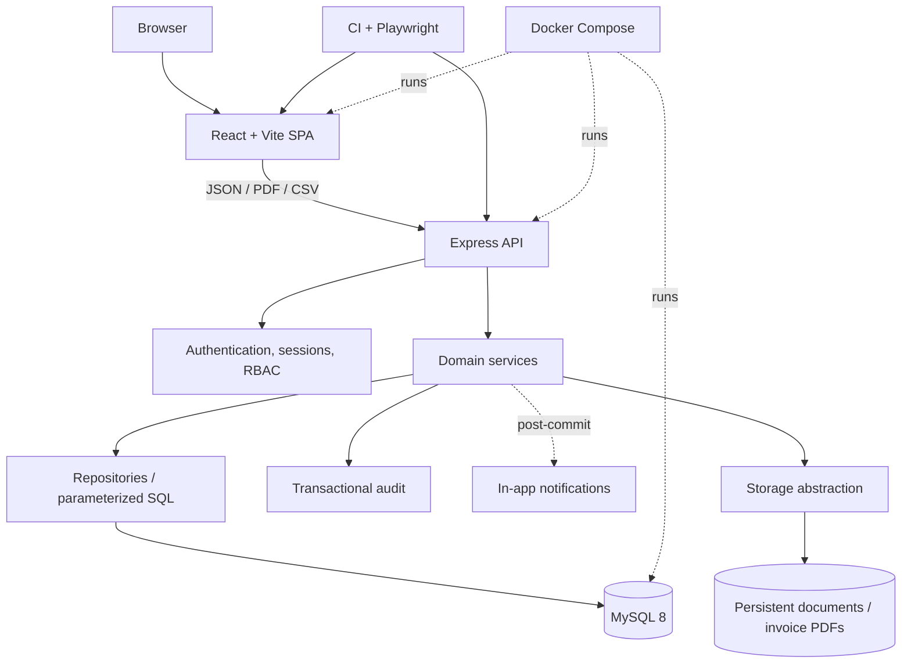
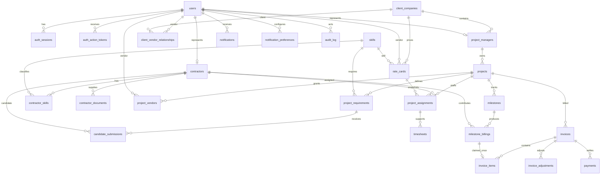

# Final Architecture

## Runtime architecture

Routes authenticate and select role surfaces; controllers validate transport input; services own domain rules and transactions; repositories own SQL. React is never an authorization boundary. Audit writes for critical mutations occur inside the business transaction; notification delivery occurs after commit and is failure-isolated.

## Final ERD (principal entities)

`schema_migrations` is a standalone operational ledger keyed by migration filename and checksum; it has no fictional self-relationship. The diagram intentionally omits some support columns while naming only tables present in migrations `001`–`037`.

## Business workflow

Approved work, billable eligibility, invoiced value, approved invoice value, paid value, and outstanding value are separate states.

## Concurrency and lock order

| Path | Primary lock/order | Database backstop | Race outcome |
| --- | --- | --- | --- |
| Candidate acceptance | submission → requirement/project/contractor scope | unique active assignment + capacity checks | one acceptance/assignment wins |
| Assignment dates/capacity | relevant project/requirement then assignments | overlap/capacity constraints and conditional mutation | conflicting assignment rejected |
| Timesheet review | timesheet row | conditional `SUBMITTED` transition | one review wins |
| Milestone evaluation | project/milestone contribution scope | unique milestone/contractor contribution | no double billing |
| Invoice item claim | invoice then milestone billing | unique `milestone_billing_id` | one draft claims contribution |
| Invoice number/review | invoice/sequence rows | unique number + conditional status | unique number; one review wins |
| Payment | invoice then payment sum | transaction and exact decimal validation | concurrent overpayment rejected |
| Release/project close | project/assignment then readiness dependencies | conditional statuses + transactional audit | stale readiness cannot authorize close |

Services consistently start from parent/business ownership rows before child mutations, reducing inconsistent lock-order risk.
